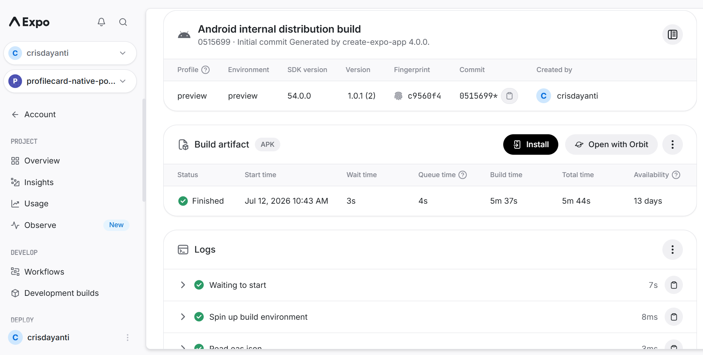
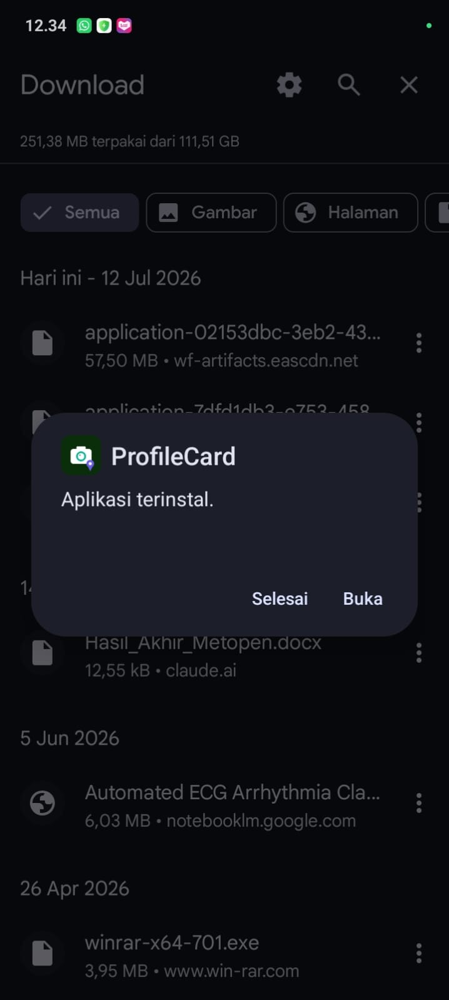
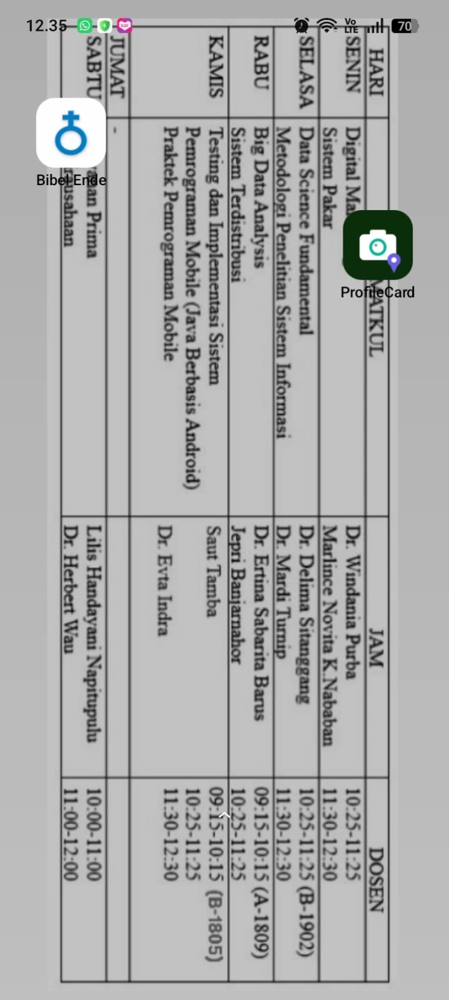
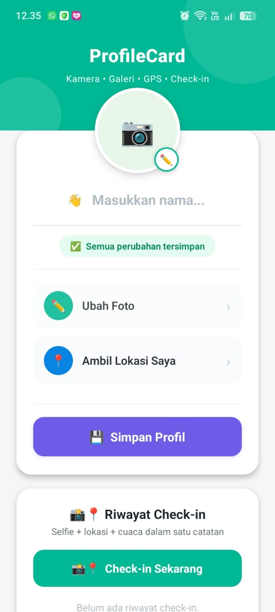

# 👤 ProfileCard — Native Power App

Aplikasi kartu profil berbasis React Native (Expo) yang memanfaatkan fitur native HP: **kamera, galeri, dan GPS**, lengkap dengan permission flow yang benar dan persistensi data.

## 📝 Deskripsi

ProfileCard memungkinkan pengguna mengambil/memilih foto profil, mengisi nama, mengambil lokasi GPS saat ini (beserta nama tempatnya lewat reverse geocoding), dan menyimpan semuanya secara lokal di HP.

## Fitur Utama

- 📸 Ambil foto profil lewat kamera atau pilih dari galeri
- 📍 Ambil lokasi GPS saat ini beserta nama tempat (reverse geocoding)
- 📸📍 Check-in — selfie + lokasi + cuaca digabung jadi satu catatan riwayat
- 🗺️ Buka lokasi langsung di Google Maps
- 💾 Semua data tersimpan otomatis di HP (persisten walau app ditutup)
- 🔐 Permission flow lengkap — meminta izin dengan sopan, menangani penolakan izin tanpa crash

## Cara Install APK

1. Download file APK lewat link di bawah
2. Pindahkan file `.apk` ke HP Android kamu
3. Buka file APK tersebut → izinkan "Install dari sumber tidak dikenal" kalau diminta → Install
4. Buka app "ProfileCard" dari app drawer

**🔗 Link download APK:** [Download di EAS Dashboard](https://expo.dev/accounts/crisdayanti/projects/profilecard-native-power/builds/02153dbc-3eb2-431e-81de-cbc5bf4fad59)

## Screenshot

<div align="center">

| Dashboard EAS (FINISHED) | Instalasi APK | Icon di App Drawer | App Berjalan (tanpa Expo Go) |
|:---:|:---:|:---:|:---:|
|  |  |  |  |

</div>

## 📋 Checklist Tugas — Mission: Ship It!

### 🟢 Level 1 — Konfigurasi & Build Dasar (WAJIB)

**A. Konfigurasi app.json Lengkap**
- ✅ Field `name`, `slug`, `version` diisi dengan benar
- ✅ Field `android.package` menggunakan format reverse domain yang valid
- ✅ Field `orientation` sesuai jenis aplikasi (`portrait`)
- ✅ `android.permissions` hanya berisi izin yang benar-benar dipakai (kamera, galeri, lokasi)
- ✅ Path icon dan splash screen mengarah ke file yang benar

**B. Aset Build Berkualitas**
- ✅ File `icon.png`: PNG, 1024×1024 px, desain kustom relevan dengan fungsi app (bukan default Expo)
- ✅ File `adaptive-icon.png`: PNG, 1024×1024 px, logo di tengah dengan padding
- ✅ File `splash.png`: PNG, 1242×2436 px, desain konsisten dengan icon
- ✅ Warna `backgroundColor` di splash sesuai brand app (hijau tua)

**C. EAS Build Berhasil**
- ✅ `eas.json` dibuat dengan profile "preview" (`buildType: "apk"`)
- ✅ `eas init` berhasil — projectId muncul di app.json
- ✅ `eas build --platform android --profile preview` menghasilkan status `FINISHED`
- ✅ File APK berhasil didownload

**D. APK Terinstall & Berjalan di HP Android**
- ✅ APK berhasil diinstall di HP Android fisik (tanpa Expo Go)
- ✅ Icon tampil di app drawer HP dengan nama yang benar
- ✅ Splash screen muncul saat app dibuka
- ✅ Fitur utama app berjalan tanpa crash

### 🟡 Level 2 — Dokumentasi Profesional

**GitHub Repository yang Rapi**
- ✅ Repo public di GitHub dengan nama yang sesuai nama app
- ✅ README.md berisi: nama app, deskripsi singkat, screenshot (minimal 3), fitur utama, cara install APK
- ✅ Link download APK (dari EAS dashboard) ditambahkan di README.md
- ✅ Screenshot bukti APK terinstall di HP ada di folder `screenshots/`

**Bukti Proses Build**
- ✅ Screenshot dashboard EAS menunjukkan build `FINISHED`
- ✅ Screenshot dialog instalasi APK di HP
- ✅ Screenshot icon app di home screen / app drawer HP
- ✅ Screenshot app berjalan di HP (tanpa frame Expo Go)

### 🔴 Level 3 — Expert (Bonus +15 Poin)

- ✅ **Bonus A (+5)** — App Version Display: versi app (dari `app.json`) ditampilkan di footer UI lewat `expo-constants`
- ✅ **Bonus B (+5)** — Link Expo Snack ditambahkan di README, menampilkan versi interaktif app online
- ✅ **Bonus C (+5)** — Build kedua dibuat setelah 1 perubahan UI (subtitle header), versi dinaikkan ke `1.0.1`, `versionCode` ke `2`, perbedaan didokumentasikan

**🔗 Expo Snack:** [Coba versi interaktif di browser](https://snack.expo.dev/@crisdayanti/crisdayanti---p14)


## 🚀 Build & Install APK (EAS Build)

Selain lewat Expo Go, app ini juga bisa di-build jadi **APK asli** yang bisa diinstall langsung di HP Android tanpa perlu Expo Go.

**1) Install EAS CLI (sekali saja di laptop):**
```bash
npm install -g eas-cli
eas login
```

**2) Inisialisasi project (sekali saja, generate `projectId` ke app.json):**
```bash
eas init
```

**3) Build APK:**
```bash
eas build --platform android --profile preview
```
Profile `preview` sudah dikonfigurasi di `eas.json` untuk menghasilkan file **`.apk`** (bukan `.aab`), supaya bisa langsung diinstall manual di HP tanpa lewat Play Store.

**4) Tunggu proses build di server Expo selesai** (status berubah jadi `FINISHED` di terminal atau di [expo.dev dashboard](https://expo.dev)), lalu download file APK-nya.

**5) Install ke HP Android:**
- Pindahkan file `.apk` ke HP (lewat kabel USB, Google Drive, dsb)
- Buka file APK di HP → izinkan "Install dari sumber tidak dikenal" kalau diminta → Install
- App akan muncul di app drawer dengan ikon & nama "ProfileCard"

**🔗 Link download APK:** [Lihat & download di EAS Dashboard](https://expo.dev/accounts/crisdayanti/projects/profilecard-native-power/builds/02153dbc-3eb2-431e-81de-cbc5bf4fad59)

## 📱 App Version Display

Versi app (dibaca dari `app.json` lewat `expo-constants`) ditampilkan sebagai footer kecil di bagian paling bawah layar utama, contoh: `ProfileCard v1.0.0`.

> Catatan: fitur kamera & GPS butuh HP fisik untuk berfungsi penuh — scan QR code di halaman Snack tersebut lewat aplikasi Expo Go untuk pengalaman lengkap.

## 🔄 Riwayat Build

| Versi | versionCode | Tanggal | Perubahan |
|---|---|---|---|
| 1.0.0 | 1 | _(isi tanggal build pertama)_ | Rilis awal — semua fitur Level 1, 2, 3 (kamera, galeri, GPS, persistensi, check-in, cuaca) |
| 1.0.1 | 2 | _(isi tanggal build kedua, setelah `eas build` dijalankan ulang)_ | Perubahan UI: subtitle header diupdate dari "Kamera • Galeri • GPS • Persistensi" menjadi "Kamera • Galeri • GPS • **Check-in**" — supaya lebih mencerminkan fitur andalan app (check-in gabungan selfie+lokasi+cuaca) yang belum tercermin di versi 1.0.0 |